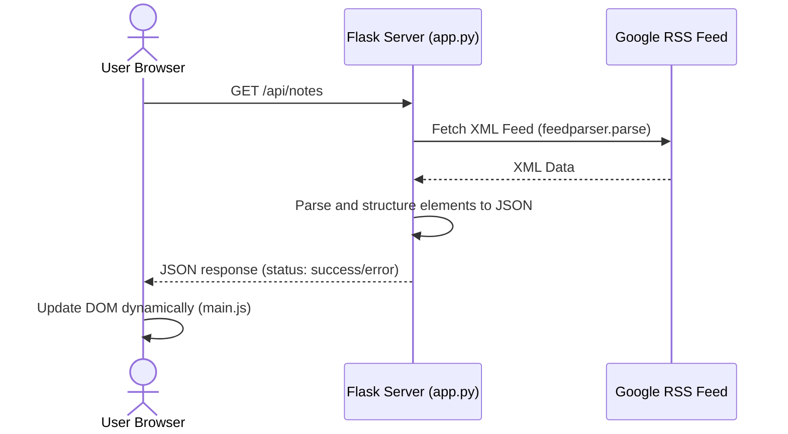

# 📊 BigQuery Release Notes App

A modern, responsive Flask web application that aggregates, parses, and displays the latest official **Google Cloud BigQuery Release Notes**. Styled with a premium dark-mode interface, the app includes asynchronous content refreshing and instant sharing to X (Twitter).

---

## 🌟 Features

* **Real-time Synchronization**: Pulls data directly from the official Google Cloud BigQuery release notes RSS/Atom feed.
* **Modern Dark-Mode Interface**: Styled using cohesive dark tokens, Google Fonts (`Outfit`), and smooth card hover animations.
* **Social Sharing Integration**: Quick sharing of individual release notes directly to X (Twitter) with custom title pre-fills and hashtags.
* **State-Driven UX**: Fully animated loaders during API fetches, automatic button disabling to prevent double clicks, and elegant error boundaries.
* **Mobile Responsive**: Flexbox/Grid-driven layouts that adapt seamlessly from desktop views to mobile viewports.

---

## 🏗️ Architecture & Data Flow

The project is structured to prevent Cross-Origin Resource Sharing (CORS) blocks on the client by using the Flask backend as a proxy feed parser.



---

## 📁 Repository Layout

```text
bq-notes-app/
├── app.py                  # Flask Application server & RSS parser API
├── requirements.txt        # Backend python dependencies
├── README.md               # Project documentation
├── templates/
│   └── index.html          # Frontend page structure & template layout
└── static/
    ├── css/
    │   └── style.css       # Core design system stylesheet & animations
    └── js/
        └── main.js         # Async AJAX caller & dynamic DOM renderer
```

---

## ⚙️ Installation & Running Locally

Follow these steps to run the application on your local machine:

### Prerequisites
* Python 3.8 or higher installed on your system.

### 1. Clone & Navigate
```bash
git clone https://github.com/abhishekbeniwal002/abhishek-bq-release-notes-app.git
cd abhishek-bq-release-notes-app
```

### 2. Set Up Virtual Environment
Create a clean environment to avoid dependency conflicts:
```bash
# Create environment
python3 -m venv venv

# Activate on Linux/macOS
source venv/bin/activate

# Activate on Windows
venv\Scripts\activate
```

### 3. Install Dependencies
Install all required packages from `requirements.txt`:
```bash
pip install -r requirements.txt
```

### 4. Run the Server
Launch the development server:
```bash
python3 app.py
```

By default, the application runs on host `0.0.0.0` at port `5000`. You can access it by navigating to:
👉 **[http://localhost:5000](http://localhost:5000)**

---

## 🛠️ Technology Stack

* **Backend Framework**: [Flask](https://flask.palletsprojects.com/) (Python)
* **RSS Feed Parsing**: [feedparser](https://github.com/kurtmckee/feedparser)
* **Design System**: Vanilla CSS3 (Custom Variables, CSS Grids, Transitions, Keyframes)
* **Frontend Scripting**: Vanilla ECMAScript 6 (Async/Await Fetch, Virtual DOM processing)
* **Icons & Web Typography**: FontAwesome 6, Google Fonts (`Outfit`)
